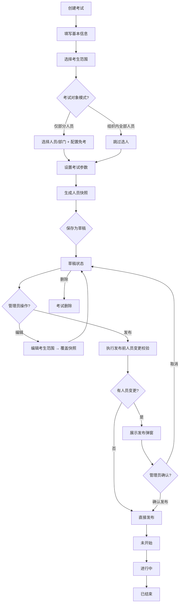
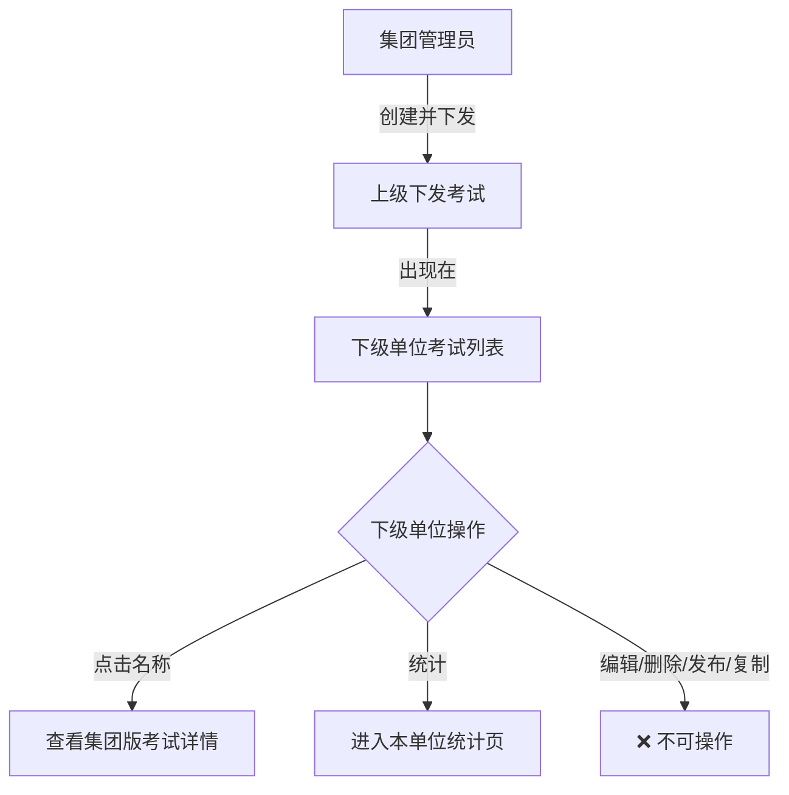
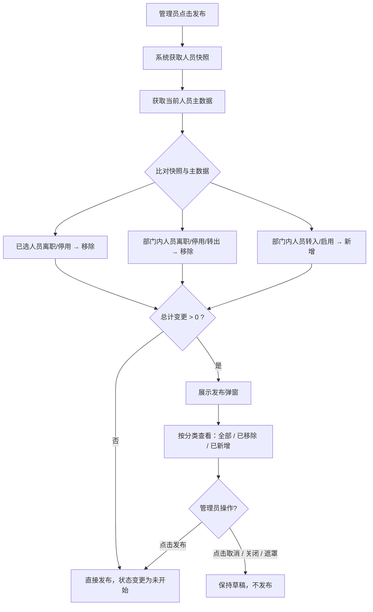
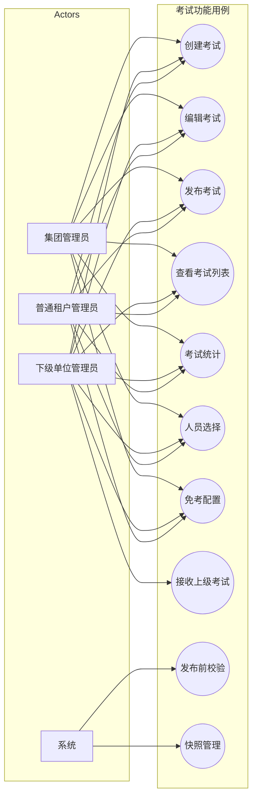

# 考试功能 — 整体 PRD

## 1. 引言

### 1.1 背景与目标

"考试功能"是 EHS+ 企业版中对员工进行安全生产知识评测的核心模块。该模块需要支持三种不同的租户形态：

- **集团（上级单位）**：跨多家子公司的人员管理形态，需要跨公司选择考试对象、查看跨公司统计数据。
- **下级单位**：处于集团层级下的成员单位，承接上级派发的考试，同时可创建本单位内部考试。
- **独立租户（普通租户/非集团）**：无上下级层级关系的独立组织，仅管理本租户范围内的考试。

本 PRD 从全局视角定义考试功能在上述三种租户形态下的统一业务规则、数据模型、角色权限和核心流程。各页面的详细交互规格请参见对应的页面 PRD。

### 1.2 用户价值

| 租户类型 | 核心价值 |
|----------|----------|
| 集团管理员 | 跨公司统一下发安全知识考试，掌握全集团各子公司的考试进展与成绩分布。 |
| 下级单位管理员 | 承接集团下发的考试任务，同时自主创建本单位专属考试来满足内部学习需求。 |
| 普通租户管理员 | 自主管理本组织的考试全生命周期，从创建、发布到统计分析形成完整闭环。 |

### 1.3 功能范围

**包含**：

| 模块 | 说明 |
|------|------|
| 考试列表 | 按租户类型展示对应的考试清单，支持新增、编辑、删除、复制、发布（草稿）、统计 |
| 新增考试 | 三步创建考试：基本信息 → 考生范围（人员/部门选择 + 免考） → 考试设置 |
| 编辑考试 | 修改草稿考试的考生范围，覆盖人员快照 |
| 考试统计 | 考试成绩、考试记录、部门统计三个页签，含人员状态筛选和部门统计在职过滤；列表支持复选框行选择（全选/单选），导出下拉菜单提供"导出全部"和"批量导出"两种模式，批量导出校验至少选中一条数据，导出文件名为「考试名称-页签名称.xlsx」 |
| 人员选择 | 按租户数据范围选择考试对象（人员 + 部门）；部门树按组织架构配置的"排序"字段升序排列，多级部门同一父级下按排序字段排列，组织架构调整排序后同步更新 | 
| 发布校验 | 草稿发布前对人员快照与当前人员主数据的差异进行校验与确认 |

**不包含**：

- 试题配置与管理（考试设置步骤中的具体试题选择不属于本次范围）
- 考生端的考试作答/提交/成绩查看
- 移动端管理能力

---

## 2. 三种租户形态概览

```
┌──────────────────────────────────────────────────────────────────┐
│                        EHS+ 考试功能                              │
│                                                                   │
│  ┌──────────────┐    ┌──────────────────┐    ┌───────────────┐   │
│  │ 集团         │    │  下级单位         │    │ 独立租户      │   │
│  │ (上级单位)    │───▶│  (子公司/分公司)   │    │ (非集团组织)   │   │
│  │              │    │                  │    │               │   │
│  │ • 跨公司选人  │    │ • 承接上级考试    │    │ • 自建考试    │   │
│  │ • 自建考试    │    │ • 自建本单位考试  │    │ • 本单位数据  │   │
│  │ • 跨公司统计  │    │ • 本单位统计     │    │ • 本单位统计  │   │
│  └──────────────┘    └──────────────────┘    └───────────────┘   │
│                                                                   │
│  数据范围: 集团全部公司     数据范围: 本单位+下属部门                  │
│  人员列: 含"所属公司"      人员列: 无"所属公司"                   无公司概念 │
│  统计视图: 部门明细/公司汇总 统计视图: 部门明细                     同下级单位 │
└──────────────────────────────────────────────────────────────────┘
```

### 2.1 核心差异对照表

| 差异维度 | 集团 | 下级单位 | 独立租户/普通租户 |
|----------|------|----------|-------------------|
| 人员数据范围 | 集团内全部公司 | 本单位 + 下属部门 | 本租户内全部人员 |
| 跨公司选人 | ✅ 支持 | ❌ 不支持 | ❌ 不涉及（无公司概念） |
| 上级下发考试 | ❌ 不涉及 | ✅ 考试列表展示上级下发 | ❌ 不涉及 |
| 上级下发考试操作 | — | 仅"统计" | — |
| 人员列表分组 | 按公司分组 | 不分组、平铺展示 | 不分组、平铺展示 |
| 考试成绩/考试记录列表 | 含"所属公司"列 | 无"所属公司"列 | 无"所属公司"列 |
| 部门筛选方式 | 公司+部门级联 | 部门下拉树 | 部门下拉树 |
| 统计部门视图 | 部门明细 + 公司汇总 | 部门明细 | 部门明细 |
| 人员选择器页面 | 人员选择-集团 | 人员选择-下级单位 | 人员选择-下级单位 |

---

## 3. 角色与权限

| 角色 | 租户端 | 可创建考试 | 可选择的考试对象范围 | 可编辑考试 | 可查看统计 | 说明 |
|------|--------|-----------|---------------------|-----------|-----------|------|
| 集团管理员 | 集团 | ✅ | 集团全部公司的人员和部门 | ✅ 仅草稿 | ✅ 全集团 | 可跨公司管理考试全生命周期 |
| 下级单位管理员 | 下级单位 | ✅ 本单位考试 | 本单位 + 下属部门 | ✅ 仅自建草稿 | ✅ 本单位 | 可承接上级下发考试，对其进行统计查看 |
| 普通租户管理员 | 独立租户 | ✅ | 本租户全量人员 | ✅ 仅草稿 | ✅ 本租户 | 与下级单位类似，但无上下级关系 |

### 3.1 下级单位对上级下发考试的操作权限

| 操作 | 本单位自建考试 | 上级下发考试 |
|------|:---:|:---:|
| 查看详情（名称链接） | ✅ | ✅（查看集团版详情） |
| 统计 | ✅ | ✅ |
| 预览 | ✅ | ❌ |
| 发布 | ✅ 草稿 | ❌ |
| 编辑 | ✅ 草稿 | ❌ |
| 复制 | ✅ | ❌ |
| 删除 | ✅ | ❌ |
| 批量删除 | ✅ | ❌ |

---

## 4. 名词解释

| 术语 | 定义 |
|------|------|
| **考试** | 一次完整的考试活动，包含基本信息、考生范围、考试设置、题目配置等。 |
| **考生范围** | 考试的目标对象集合，可通过选择人员（已选人员）或部门范围来定义。 |
| **已选人员** | 以单个人员为维度选定的考试对象。 |
| **已选部门** | 以部门为维度选定的考试对象，选择某部门即包含该部门下（可选含下级部门）的全体人员。 |
| **组织内全部人员** | 考试对象覆盖当前租户范围内的全部人员，无需单独选择。 |
| **仅部分人员** | 考试对象仅为管理员选择的具体人员或部门范围内的人员。 |
| **免考人员** | 被排除在考试要求之外的人员或部门，不计入应考人数，不影响参与率和及格率计算。 |
| **人员快照** | 创建考试或编辑保存时对当时考试对象范围内所有人员的完整记录（含 ID、姓名、所属公司、部门、人员状态），用于发布前人员变更校验。 |
| **人员状态** | 枚举值：在职（启用）、离职、停用（禁用）。 |
| **草稿** | 考试创建后尚未发布的初始状态，支持编辑和发布。 |
| **未开始** | 考试发布后但尚未到达考试开始时间的状态。 |
| **进行中** | 考试正处于考试时间段内的状态。 |
| **已结束** | 考试时间已过的状态。 |
| **上级下发考试** | 由集团或上级单位创建并推送给下级单位的考试，下级单位不可编辑、删除、发布。 |
| **自建考试** | 当前租户管理员自行创建的考试。 |
| **公司汇总** | 集团独有的统计视图，以公司为粒度对部门数据进行扁平汇总展示。 |
| **部门明细** | 以部门树结构展示统计数据的视图。 |
| **部门排序** | 人员选择器的部门树按组织架构配置的"排序"（sortOrder）字段升序排列。多级部门按层级分别排序，同一父级下的兄弟节点按排序字段升序排列，排序字段值相同则按部门名称拼音排序。组织架构管理员调整部门排序后，人员选择弹窗的部门树同步更新。 |

---

## 5. 核心业务流程图

### 5.1 考试全生命周期（通用）



### 5.2 下级单位特殊流程：上级下发考试



### 5.3 发布前人员变更校验流程



---

## 6. 用例图



---

## 7. 非功能性需求

### 7.1 性能要求

| 指标 | 要求 |
|------|------|
| 考试列表查询响应 | ≤ 2s（1000 条以内） |
| 人员选择器加载 | ≤ 3s（10,000 以内人员数据） |
| 部门人数重新计算 | ≤ 3s |
| 发布前人员变更校验 | ≤ 5s（包含三分类校验） |
| 考试统计查询 | ≤ 3s |
| 并发支持 | 支持 100+ 管理员同时操作 |

### 7.2 安全性

| 要求 | 说明 |
|------|------|
| 数据隔离 | 不同租户数据严格隔离，下级单位不可访问集团或平级单位数据 |
| 操作权限 | 上级下发考试在下级单位侧仅开放"统计"操作，编辑/删除/发布等操作需校验考试来源为自建 |
| 人员选择范围限制 | 下级单位人员选择器限定本单位及下属部门，不可越权访问平级或上级单位人员 |
| 快照安全 | 人员快照为只读历史数据，持久化后不可篡改 |

### 7.3 兼容性

| 要求 | 说明 |
|------|------|
| 浏览器 | Chrome 90+、Edge 90+、Safari 14+ |
| 分辨率 | 1366×768 及以上 |

### 7.4 可维护性

| 要求 | 说明 |
|------|------|
| 操作日志 | 考试创建、编辑、发布、删除需记录操作日志 |
| 快照审计 | 快照生成和覆盖保留历史记录，发布校验时可回溯 |

---

## 8. 页面清单与关联 PRD

### 8.1 集团（上级单位）

| 序号 | 页面名称 | 页面 PRD 路径 | 原型文件 |
|------|---------|--------------|---------|
| 1 | 考试列表-集团 | `prd/考试列表-集团.md` | `考试列表-集团.html` |
| 2 | 新增考试-集团 | `prd/新增考试-集团.md` | `新增考试-集团.html` |
| 3 | 编辑考试-集团 | `prd/编辑考试-集团.md` | `编辑考试-集团.html` |
| 4 | 考试统计-集团 | `prd/考试统计-集团.md` | `考试统计-集团.html` |
| 5 | 人员选择-集团 | — | `人员选择-集团.html` |

### 8.2 下级单位

| 序号 | 页面名称 | 页面 PRD 路径 | 原型文件 |
|------|---------|--------------|---------|
| 1 | 考试列表-下级单位 | `prd/考试列表-下级单位.md` | `考试列表-下级单位.html` |
| 2 | 新增考试-下级单位 | `prd/新增考试-下级单位.md` | `新增考试-下级单位.html` |
| 3 | 编辑考试-下级单位 | `prd/编辑考试-下级单位.md` | `编辑考试-下级单位:独立租户.html` |
| 4 | 考试统计-本单位 | `prd/考试统计-本单位.md` | `考试统计-下级单位:独立租户.html` |
| 5 | 考试统计-上级下发 | `prd/考试统计-上级下发.md` | `考试统计-下级单位:独立租户.html` |
| 6 | 人员选择-下级单位：本单位 | — | `人员选择-下级单位:本单位.html` |
| 7 | 人员选择-下级单位 | — | `人员选择-下级单位.html` |

### 8.3 独立租户/普通租户

| 序号 | 页面名称 | 页面 PRD 路径 | 原型文件 |
|------|---------|--------------|---------|
| 1 | 考试列表 | `prd/考试列表-普通租户.md` | `考试列表-普通租户.html` |
| 2 | 新增考试 | —（参考集团/下级新增） | `新增考试-普通租户.html` |
| 3 | 编辑考试 | —（参考下级编辑，同数据范围） | `编辑考试-下级单位:独立租户.html` |
| 4 | 考试统计-本单位 | `prd/考试统计-本单位.md` | `考试统计-普通租户.html` |

### 8.4 通用页面

| 序号 | 页面名称 | 说明 | 原型文件 |
|------|---------|------|---------|
| 1 | 规则说明 | 考试功能入口的规则说明页 | `规则说明.html` |

### 8.5 小程序

| 序号 | 页面名称 | 说明 | PRD 路径 | 原型文件 |
|------|---------|------|---------|---------|
| 1 | 考试列表 | 小程序端考试列表 | `prd/小程序考试列表.md` | `小程序考试列表.html` |

---

## 9. 附录

### 9.1 租户数据范围矩阵

```
┌────────────────┬──────────────────────┬──────────────────────┬──────────────────┐
│   能力 \ 租户   │        集团           │       下级单位         │    独立租户        │
├────────────────┼──────────────────────┼──────────────────────┼──────────────────┤
│ 创建考试        │ 集团跨公司            │ 本单位+下属部门        │ 本租户            │
│ 上级下发考试     │ 不涉及（集团不下发自己） │ ✅ 列表展示+接收       │ ❌ 不涉及          │
│ 跨公司选人       │ ✅                    │ ❌                    │ ❌ 无公司概念       │
│ 人员按公司分组    │ ✅                    │ ❌ 平铺标签            │ ❌ 平铺标签        │
│ 列表含所属公司列  │ ✅ 考试成绩/考试记录    │ ❌                    │ ❌                │
│ 部门筛选          │ 公司+部门级联          │ 部门下拉树            │ 部门下拉树         │
│ 统计视图          │ 部门明细 + 公司汇总     │ 部门明细              │ 部门明细           │
│ 人员选择器        │ 人员选择-集团          │ 人员选择-下级单位       │ 人员选择-下级单位    │
│ 快照含公司字段    │ ✅                    │ ❌                    │ ❌                │
│ 分类树上级下发节点 │ ❌                    │ ✅                    │ ❌                │
└────────────────┴──────────────────────┴──────────────────────┴──────────────────┘
```

### 9.2 页面状态流转

| 当前状态 | 触发操作 | 目标状态 | 前置条件 |
|----------|---------|---------|----------|
| — | 创建考试（保存草稿） | 草稿 | 基本信息填写完成 + 考生范围选择（部分人员模式下至少 1 人或 1 部门） |
| 草稿 | 编辑保存 | 草稿 | 编辑后覆盖人员快照 |
| 草稿 | 发布（无变更） | 未开始 | 无人员变更 |
| 草稿 | 发布（有变更→确认） | 未开始 | 管理员在发布弹窗确认 |
| 草稿 | 删除 | — | — |
| 未开始 | 到达开始时间 | 进行中 | 系统自动 |
| 进行中 | 到达结束时间 | 已结束 | 系统自动 |

### 9.3 版本变更记录

| 版本 | 日期 | 变更内容 | 作者 |
|------|------|----------|------|
| V1.0 | 2026-07-13 | 初版。统一定义集团/下级单位/独立租户三种形态下考试功能的全局业务规则、数据模型、角色权限、核心流程和页面清单。 | — |
| V1.1 | 2026-07-16 | 新增部门树排序规则：人员选择弹窗中部门树按组织架构配置的"排序"（sortOrder）字段升序排列，多级部门同一父级下按排序字段排列，组织架构调整排序后同步更新。 | — |

### 9.4 引用标准

- 本 PRD 作为"总分结构"中的总纲，各页面详细交互/UI 规格参见对应的页面 PRD。
- 所有页面 PRD 的编号均以本 PRD 中第 8 节的页面清单为索引。
- 三种租户的独特规则已在各差异对照表和矩阵中明确标注。
